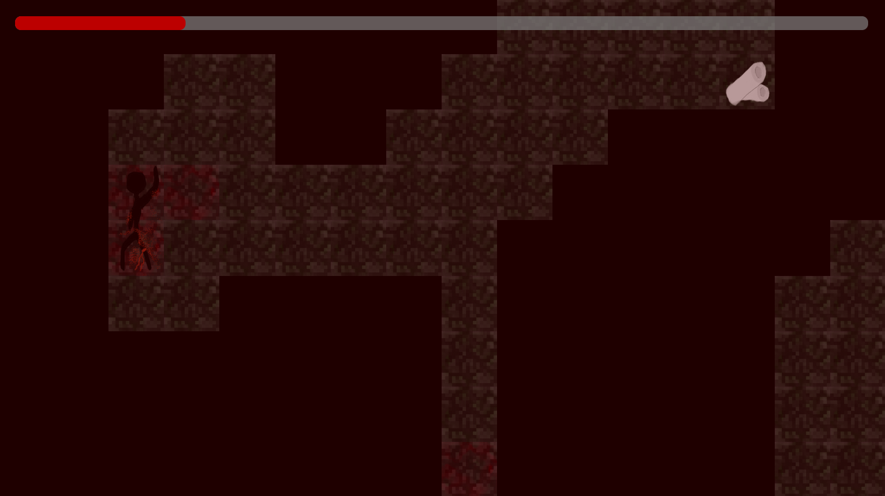

# The Last - A game made for the LD39 game jam

Link to submission: https://ldjam.com/events/ludum-dare/39/the-lost  
Play now: https://vija02.github.io/LD39

---

## About the game

This is a quick survival/exploration game about a cave that you have accidentally discovered. Hurt by the fall, you are quickly losing power and need immediate treatment. 

Think fast and explore efficiently if you want to make it out alive!

### Controls
**Movement** : WASD/Arrow Keys  
**Interact** : Enter/Space/Z/Mouse

---

## Technical Details
This game is made using **React**, bootstrapped with create-react-app.
It is hosted with github, so you can find the HTML files in the `gh-pages` branch of this repo. 

No game engine was used and everything was developed from scratch in the span of 48 hours. This project also demonstrates the power of CSS grid in its infancy.
